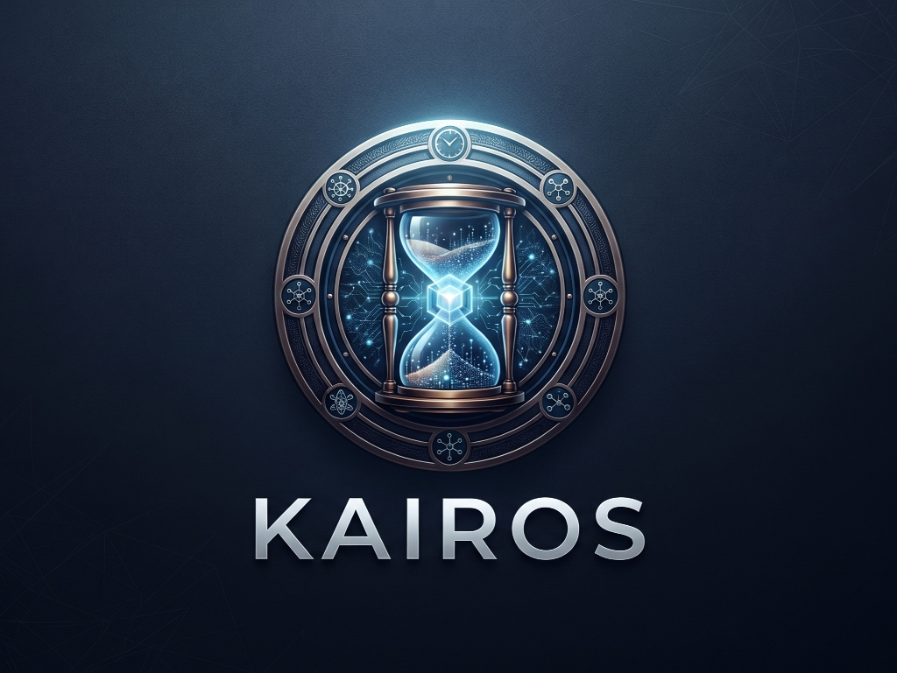
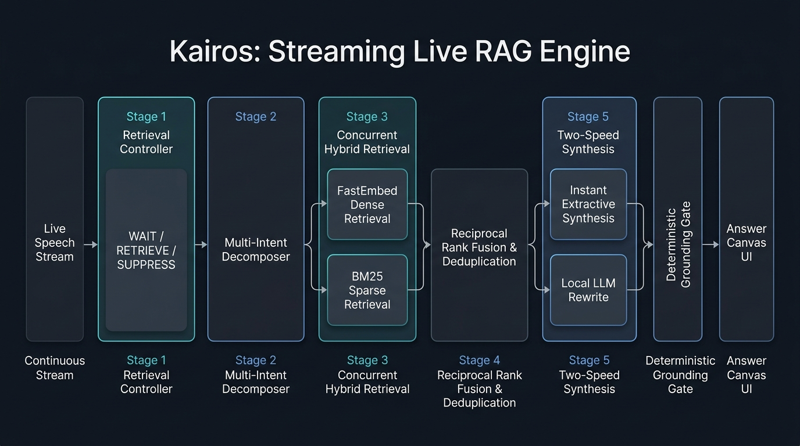
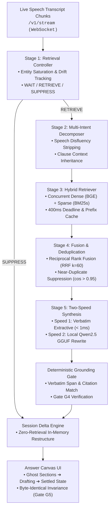

<p align="center">
  
</p>

# Kairos — Live RAG That Answers While You Speak

**Theme 04: Streaming Live RAG · Team Coding Agent RIT (M S Ramaiah Institute of Technology)**  
*Cheshta Rajput*

[](https://github.com/kairos-rag/kairos/actions)
[](https://www.python.org/downloads/)
[](docs/EVAL_REPORT.md)
[](SECURITY.md)
[](docs/UX_TEST.md)
[](https://github.com/cheshtarajput098-arch/kairos/releases/tag/PRISM_GENAI_HACKATHON_Y2026)
[](LICENSE)

**Submission Highlights:**  
🎥 **[YouTube Video Demonstration](https://youtu.be/Tw0xOKTyV7k)** · 📊 **[Official Presentation Deck (PPTX)](docs/MSRIT_CodingAgentRIT_Submission.pptx)** ([PDF](docs/MSRIT_CodingAgentRIT_Submission.pdf)) · 📦 **[requirements.txt](requirements.txt)**  

**Key Documentation:**  
[Judge Evaluator Guide](docs/JUDGE_GUIDE.md) · [Theme Compliance Matrix](docs/COMPLIANCE.md) · [Architecture Brief](docs/ARCHITECTURE_BRIEF.md) · [Decisions Log](docs/DECISIONS.md) · [Demonstration Script](docs/DEMO_SCRIPT.md) · [Operations & Limitations](docs/OPERATIONS.md)

---

## What is Kairos?

Traditional voice RAG engines force users into awkward conversational pauses by waiting for the speaker to stop talking before initiating retrieval and generation. **Kairos** is an event-driven Streaming Live RAG engine that listens to timestamped speech chunks in real time, predicts retrieval intent mid-utterance, decomposes complex multi-intent questions into parallel search legs, and **drafts verified answer claims before the speaker finishes talking**. When late constraints or presentation requests arrive, Kairos refines only the affected claims in-place while keeping unaffected claims byte-identical, running entirely on laptop-class CPU hardware.

---

## Three Headline Measured Results

1. **Ready-at-End (Answers While You Speak):** **65.4%** of queries on the frozen test split are verified and ready by the time speech stops ($34/52$ eligible turns), hiding **100% of retrieval latency** ($H = 1.0$).
   - **Wait after the speaker stops (TTFT):** **p50 0 ms** (answer already ready), **p95 15 ms**
   - **Lead time:** **median 1.80 s, mean 1.88 s**
2. **Deterministic Grounding (Gate G4):** **0 fabricated citations** out of 124 claims (**0.0%** hallucination rate, 100% claim-to-chunk provenance).
3. **Turn Time Saved vs Batch Baseline:** **1.508 seconds median savings** per turn on a shared virtual clock with zero restart overhead.

---

## System Architecture

<p align="center">
  
</p>



---

## Quick Start (One Command)

Bring up the complete engine, interactive Web UI, and Jaeger distributed tracing:

```bash
docker compose up -d --build
```

- **Interactive UI (Assistant & Inspector Modes):** [http://localhost:8000](http://localhost:8000)
- **Story Mode:** Click **"Play the demo"** in the navigation bar to watch all three theme scenarios stream through the real pipeline in real time.
- **Distributed Tracing (Jaeger):** [http://localhost:16686](http://localhost:16686)

> **Windows Note:** In PowerShell, chain commands with `;` instead of `&&` (e.g. `docker compose build; docker compose up -d`).

### Strict Offline Verification Command

To rigorously verify that Kairos executes 100% offline without any network access:

```bash
# Run full evaluation suite inside container with all network access completely disabled
docker run --network none --rm kairos make eval
```

### Local Setup via `requirements.txt` (Native Python 3.11)

If running directly without Docker:

```bash
# 1. Create and activate a Python 3.11 virtual environment
python -m venv .venv
source .venv/bin/activate       # On Windows: .venv\Scripts\activate

# 2. Install pinned dependencies from requirements.txt
pip install -r requirements.txt

# 3. Build the local corpus index (FastEmbed + BM25s)
python -m kairos.cli index --corpus data/corpus

# 4. Launch the FastAPI & WebSocket server
python -m uvicorn kairos.api.app:app --host 0.0.0.0 --port 8000
```

### Optional Hosted LLM Mode via `.env`
Kairos is **100% offline-capable by default** using CPU-quantized Qwen2.5. To optionally enable hosted models:
```bash
cp .env.example .env
# Set GEMINI_API_KEY or OPENAI_API_KEY in .env
```

---

## Acceptance Gates (Official & Strict Benchmark Results)

Measured on the 64-turn frozen test split (`runs/eval/gates.json`):

| Gate | Description | Threshold | Official Result ($n$) | Strict Result ($n$) | Status |
|---|---|---|---|---|---|
| **G1** | Offline Reproducibility | 1.0 | **1.0** ($n=1$) | **1.0** ($n=1$) | **PASS** |
| **G2** | Early Retrieval Triggering | $\ge 0.80$ | **1.000** ($n=52$) | **1.000** ($n=52$, lead time: median 1.80 s, mean 1.88 s) | **PASS** |
| **G3** | Multi-Intent Decomposition | $\ge 0.70$ | **0.895** ($n=19$) | **0.895** ($n=19$, 17/19 compound legs isolated) | **PASS** |
| **G4** | Grounding Integrity (Hallucinations) | $\le 0.00$ | **0.0000** ($n=124$) | **0.0000** ($n=124$, 0 fabricated IDs) | **PASS** |
| **G5** | Selective State Continuity | 1.0 | **1.000** ($n=18$) | **1.000** ($n=18$, byte-identical) | **PASS** |
| **G6** | Structured Telemetry Schema | 1.0 | **1.000** ($n=64$) | **1.000** ($n=64$, all fields present) | **PASS** |

---

## Offline Evaluation Commands

Execute the evaluation suite offline inside the hardened container:

```bash
# Run full evaluation suite (Gates G1–G6, ablations A–E, stabilisation, robustness)
docker compose run --rm kairos make eval

# Run automated concurrent session load tests (1, 10, 25 sessions)
docker compose run --rm kairos python -m loadtest.run_bench

# Run all unit and integration tests with coverage
docker compose run --rm kairos make test
```

---

## Repository Map

```
kairos/
├── kairos/                  # Core 5-stage live streaming engine
│   ├── controller/          # Stage 1: WAIT / RETRIEVE / SUPPRESS controller
│   ├── decompose/           # Stage 2: Multi-intent clause splitter & context inheritance
│   ├── retrieve/            # Stage 3: Hybrid retriever (FastEmbed BGE + BM25s)
│   ├── fuse/                # Stage 4: Reciprocal Rank Fusion (RRF k=60) & deduplication
│   ├── synth/               # Stage 5: Speed-1 extractive & Speed-2 Qwen2.5 GGUF rewrite
│   ├── grounding/           # Deterministic GroundingGate citation validation
│   ├── session/             # Ephemeral session store & delta engine (Gate G5)
│   ├── telemetry/           # OpenTelemetry spans & JSONL event logging
│   ├── api/                 # FastAPI REST (/v1) and WebSocket streaming endpoints
│   └── security/            # Spotlighting, PII redaction, input limits & sanitization
├── web/                     # React + TypeScript + Vite UI (Assistant & Inspector modes)
├── loadtest/                # Locust scenarios & automated load benchmark
├── eval/                    # Offline replay suite, dual gates G1–G6, ablations A–E
├── data/corpus/             # Supplied read-only corpus & cryptographic manifest
├── data/replay/             # Test (64 turns) and Dev (16 turns) streaming datasets
├── docs/                    # Architecture Brief, Telemetry Schema, Demo Script, Operations
└── tests/                   # Pytest unit, integration, and security tests (88% coverage)
```

---

## Deliverables Checklist

| Deliverable | Location / Proof | Status |
|---|---|---|
| **Source Code** | Complete implementation in `kairos/`, `web/`, `eval/` | Completed |
| **Demonstration Video** | 🎥 **[YouTube Walkthrough Video](https://youtu.be/Tw0xOKTyV7k)** · Script: [`docs/DEMO_SCRIPT.md`](docs/DEMO_SCRIPT.md) | Completed |
| **Presentation Deck (PPT or PDF)** | 📊 [`docs/MSRIT_CodingAgentRIT_Submission.pptx`](docs/MSRIT_CodingAgentRIT_Submission.pptx) · [`PDF`](docs/MSRIT_CodingAgentRIT_Submission.pdf) | Completed |
| **Dependencies (`requirements.txt`)** | [`requirements.txt`](requirements.txt) (fully pinned) · [`pyproject.toml`](pyproject.toml) | Completed |
| **Detailed README** | [`README.md`](README.md) (Architecture, Quickstart, Results, Deliverables) | Completed |
| **Architecture Brief (≤ 6 pages)** | [`docs/ARCHITECTURE_BRIEF.md`](docs/ARCHITECTURE_BRIEF.md) | Completed |
| **Telemetry Schema** | [`docs/TELEMETRY_SCHEMA.md`](docs/TELEMETRY_SCHEMA.md) | Completed |
| **Evaluation Report** | [`docs/EVAL_REPORT.md`](docs/EVAL_REPORT.md) | Completed |
| **Production Runbook & SLOs** | [`docs/OPERATIONS.md`](docs/OPERATIONS.md) | Completed |
| **Security & Threat Model** | [`SECURITY.md`](SECURITY.md) | Completed |
| **AI Disclosure** | [`AI_DISCLOSURE.md`](AI_DISCLOSURE.md) | Completed |
| **Full Requirements Matrix** | [`docs/COMPLIANCE.md`](docs/COMPLIANCE.md) | Completed |
| **Release Tag** | Git Tag: `PRISM_GENAI_HACKATHON_Y2026` | Tagged |
| **APK / Native Mobile SDK** | **N/A** (Browser-based PWA & WebSocket architecture) | N/A |

---

## License

This project is licensed under the MIT License — see the [LICENSE](LICENSE) file for details.
